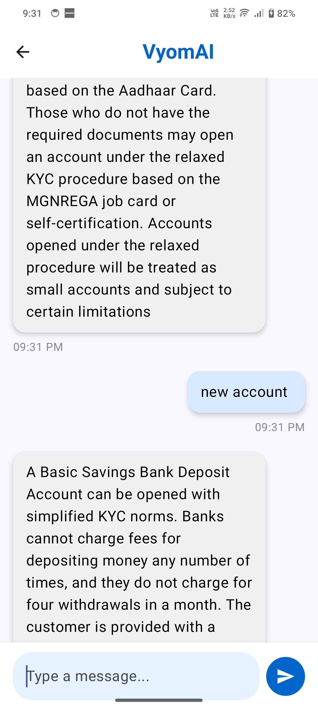

# Vyom Assist 📱


## A Secure, AI-Powered Customer Service Solution for Union Bank of India

Vyom Assist is a modern Android application that provides secure customer service through facial authentication, smart ticketing, and AI-powered banking service recommendations. Built with Jetpack Compose and Kotlin, it delivers a reactive UI with robust backend communication.

## 🚀 Features

- **AI-based Face + Liveness Authentication** - Secure identity verification
- **Smart Customer Redirection + SIM Binding** - Differentiated flows for new vs existing users
- **Chatbot & Customer Care Interface** - AI-powered support
- **Ticket Generation with Multimedia Support** - Attach images, audio, and video to support tickets
- **Real-Time Product Recommendation** - AI-based banking product suggestions
- **In-app Chat & Support Ticket History** - Track all communications
- **Modular Integration with Web Dashboard** - Seamless cross-platform experience

## ⚙️ Tech Stack

### Frontend
- **Language**: Kotlin
- **UI Toolkit**: Jetpack Compose
- **Navigation**: Navigation Compose
- **Camera & Media**: CameraX, ML Kit (Face Detection)
- **JSON Parsing**: Moshi & Gson
- **Networking**: Retrofit + OkHttp + Interceptors
- **State Management**: ViewModel, LiveData, Coroutines
- **Asynchronous Operations**: Kotlin Coroutines, Flows

### Backend & APIs
- **Database**: MySQL (hosted on CPanel)
- **Backend Language**: PHP (REST APIs)
- **File Storage**: CPanel File Manager
- **Face Comparison API**: Google Cloud + gRPC (Hosted separately)

## 📦 Project Setup

### Requirements
- Android Studio Flamingo or later
- Minimum SDK: 24
- Target SDK: 34
- Compile SDK: 35

### Gradle Configuration
```kotlin
plugins {
    alias(libs.plugins.android.application)
    alias(libs.plugins.kotlin.android)
    alias(libs.plugins.kotlin.compose)
}

android {
    namespace = "com.swag.vyom"
    compileSdk = 35
    
    defaultConfig {
        applicationId = "com.swag.vyom"
        minSdk = 24
        targetSdk = 34
        // Other config
    }
}
```

### Key Dependencies
- Jetpack Compose (material3, ui, tooling, navigation)
- CameraX (camera-core, camera-view, camera-video, camera-lifecycle)
- ML Kit: Face Detection
- Retrofit + Moshi + Gson (for API and data parsing)
- gRPC: For Customer Care Chatbot
- Google Cloud Dialog Flow: (Chatbot interface)

## 📂 Data Models


### Support Ticket
```kotlin
data class SupportTicket(
    val ticket_id: String,
    val ticket_created_at: String,
    val category: String,
    val preferred_support_mode: String,
    val status: String,
    val sub_category: String,
    val urgency_level: String,
    val connection_way: String,
    val assigned_agent_id: Int?,
    val isRated: Int
)
```

### Ticket Creation
```kotlin
data class Ticket(
    val user_id: Int,
    val category: String,
    val sub_category: String,
    val urgency_level: String,
    val preferred_support_mode: String,
    val available_timedate: String,
    val language_preference: String,
    val description: String,
    val audio_file_link: String? = null,
    val video_file_link: String? = null,
    val attached_image_link: String? = null,
    val assigned_department: String? = null,
    val priority_level: String = "",
    val attached_file: String
)
```

## 🔌 API Integration

### Base URLs
- Main API: `https://sggsapp.co.in/vyom/`
- Face Comparison Service: `https://deepfaceapiservice-662317823212.asia-south1.run.app/compare_faces`

### API Endpoints
- `generateTicket()` – Creates a new support request
- `compareFaces()` – Validates facial authentication using external ML model
- `uploadFile()` – For video, audio, or document attachment
- `fetchTicketsByUserId()` – Loads user history
- `register/login()` – Auth endpoints
- `fetch_msg_history()` – Chat history retrieval
- `sendMessage/getMessages()` – Chat messaging API

## 🤖 FaceAuth API


### Overview
Provides secure and accurate facial authentication services by comparing the current image frame against registered profiles. Built with Docker and Google Cloud Run for easy deployment, scaling, and maintenance.

### Key Technologies
- Action Based Liveness Detection
- DeepFace: FaceNet512 model weights for face verification
- Flask: A lightweight Python web framework
- Docker: For containerization
- Google Cloud Run: Serverless platform for deployment

### API Usage
```
API Endpoint: https://deepfaceapiservice-662317823212.asia-south1.run.app/compare_faces

Parameters:
- image_url: Database link of stored profile image
- image2: Current user image (JPEG, PNG, or JPG format)
- Request Type: POST

Response (JSON):
{
    "euclidean_distance": 13.177172612604885,
    "is_match": true,
    "threshold": 18.0
}
```

## 🧪 Optimization

- Code Shrinking and Optimization using ProGuard
- `isMinifyEnabled = true`
- `isShrinkResources = true`

## 🖼️ Screenshots





## 📋 Installation

1. Clone the repository
   ```
   git clone https://github.com/your-username/vyom-assist.git
   ```

2. Open the project in Android Studio

3. Configure your API keys in the project's `local.properties` file:
   ```
   FACE_API_KEY=your_face_api_key
   DIALOGFLOW_KEY=your_dialogflow_key
   ```

4. Build and run the application

## 📍 Conclusion

Vyom Assist is a robust, scalable, and secure banking support solution built with modern Android technologies. It integrates seamlessly with custom backend APIs, cloud storage, and AI-powered services to provide a fully automated and user-centric experience for Union Bank customers.

## 🤝 Contributing

Contributions, issues, and feature requests are welcome. Feel free to check the issues page if you want to contribute.

## 📄 License

This project is licensed under the [MIT License](LICENSE).

## 📞 Contact

For any inquiries, please contact:
- Email: your.email@example.com
- Project Link: https://github.com/your-username/vyom-assist
